# Universidade Estácio de Sá

## Curso Análise e Desenvolvimento de Sistemas

### Trabalho da disciplina Programacão para dispositivos móveis em android

### Proposta do projeto

- Aplicativo de Gerenciamento de Alunos
  - Este é um aplicativo móvel desenvolvido com React Native e Expo para auxiliar no controle e gerenciamento de alunos.
  - Ele permite que o usuário autenticado registre, edite, atualize e exclua o cadastro de um aluno.

### Apresentação

#### ```Tela Login do Usuário```

<table>
  <tr>
    <td>
      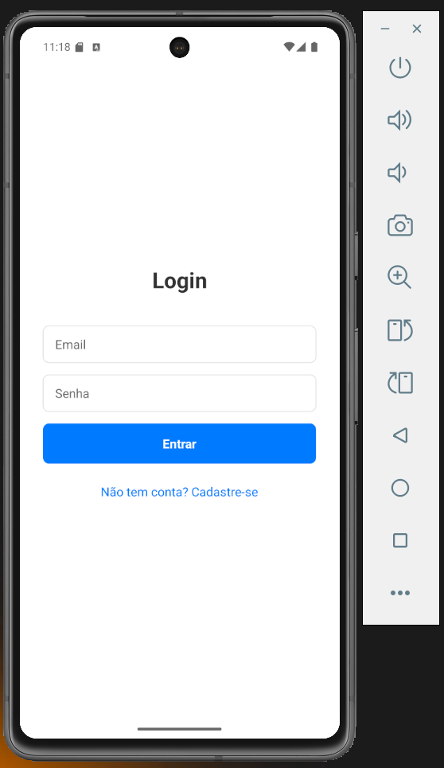
    </td>
  </tr>
</table>

#### ```Tela Cadastro do Usuário```

<table>
  <tr>
    <td>
      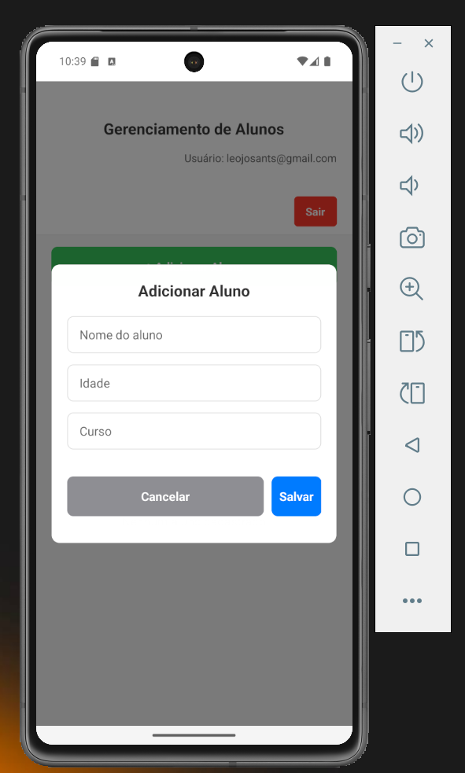
    </td>
  </tr>
</table>

#### ```Tela Usuário Logado```

<table>
  <tr>
    <td>
      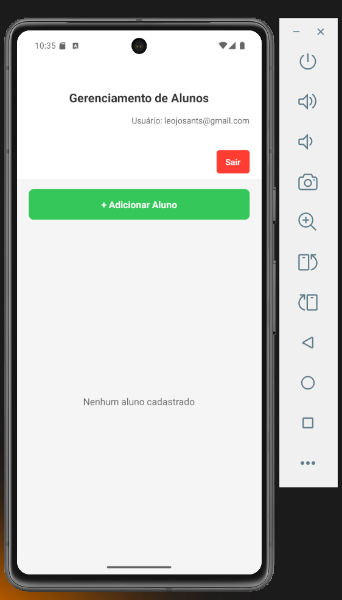
    </td>
  </tr>
</table>
  
#### ```Tela registro de Aluno```
  
<table>
  <tr>
    <td>
      
    </td>
  </tr>
</table>
  
#### ```Tela Aluno Registrado```
  
<table>
  <tr>
    <td>
      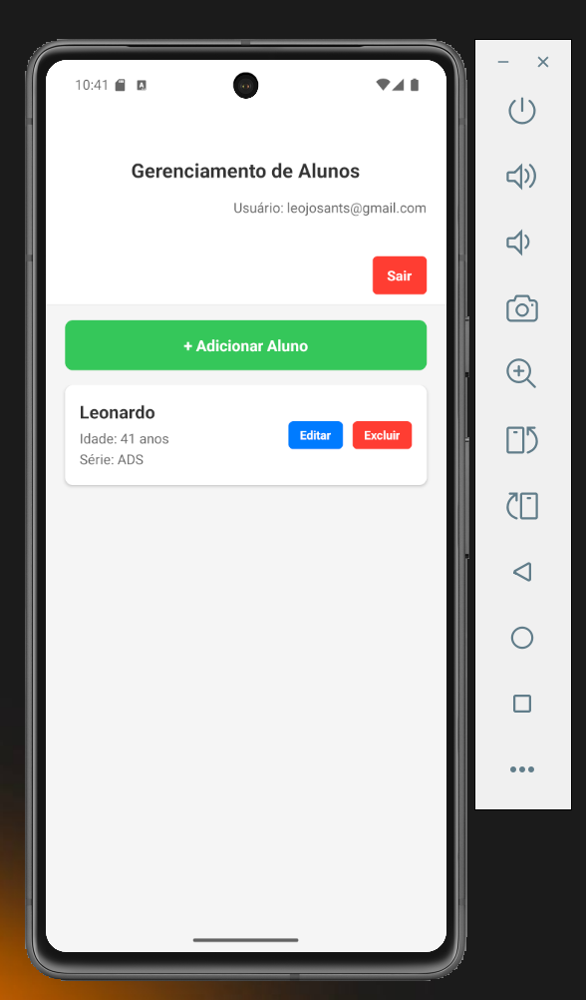
    </td>
  </tr>
</table>
  
#### ```Tela Edição de Aluno```
  
<table>
  <tr>
    <td>
      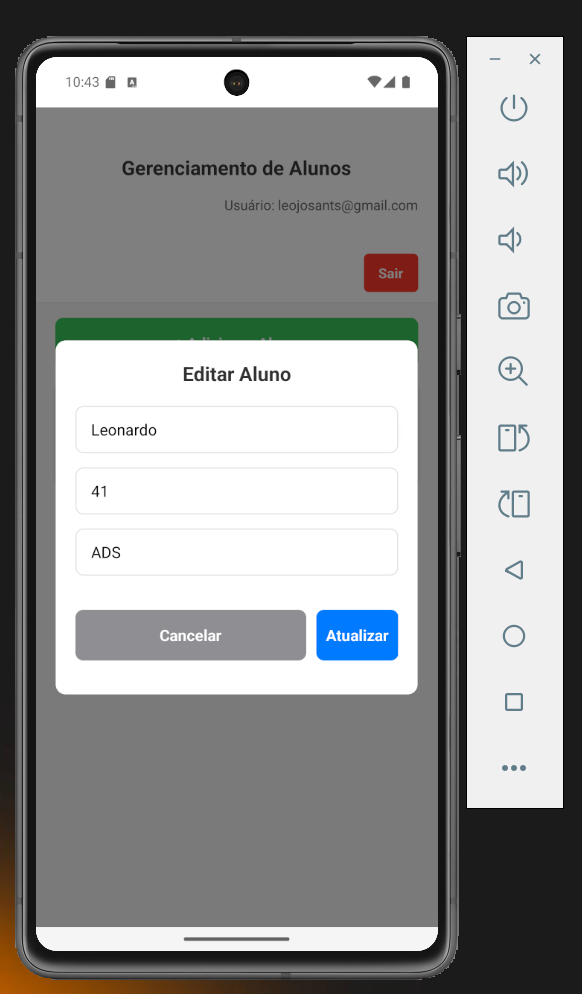
    </td>
  </tr>
</table>
  
#### ```Telas de modais de Sucesso```
  
<table>
  <tr>
    <td>
      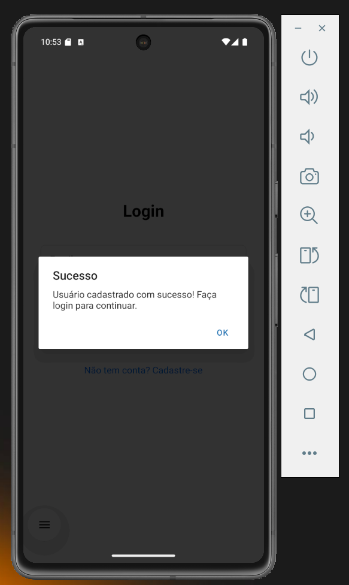
    </td>
    <td>
      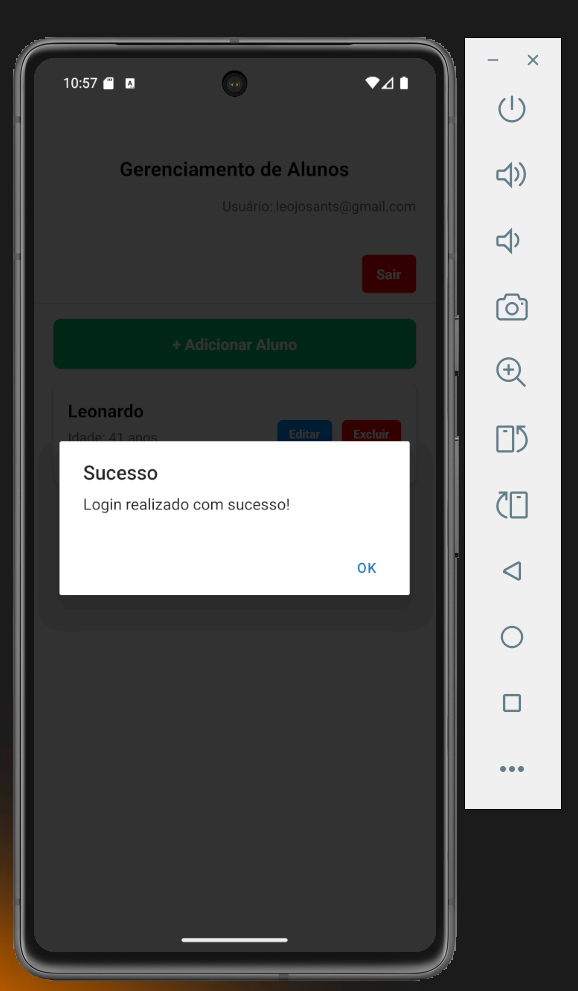
    </td>
    <td>
      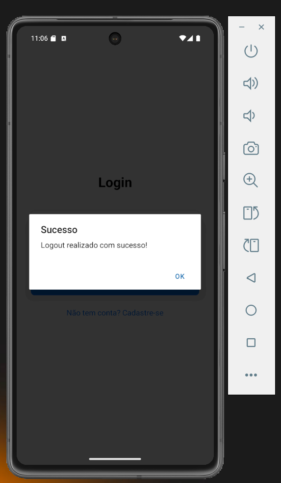
    </td>
  </tr>
</table>

<table>
  <tr>
    <td>
      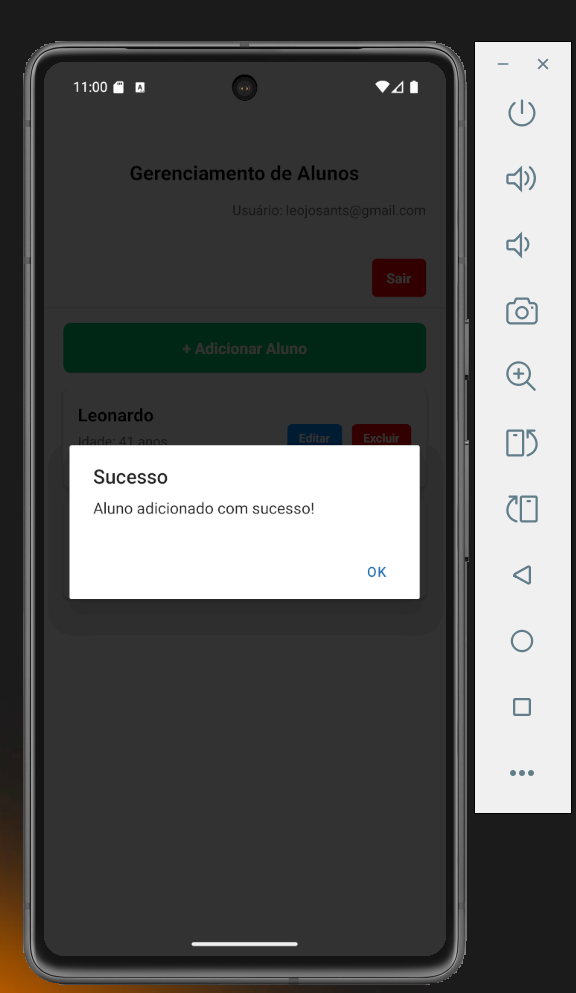
    </td>
    <td>
      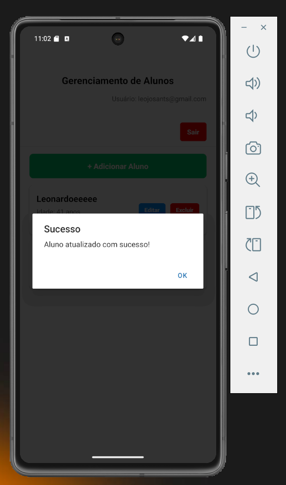
    </td>
    <td>
      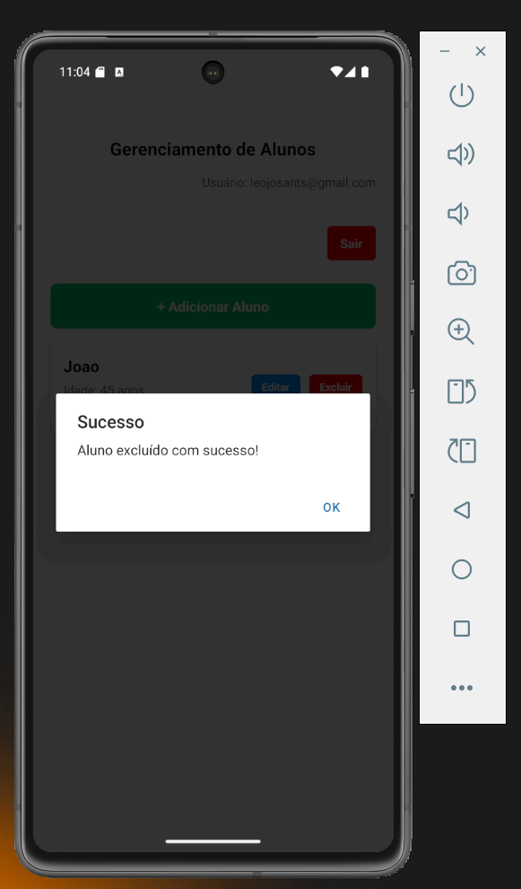
    </td>
  </tr>
</table>

### Funcionalidades

- Autenticação de Usuários
- Registro de Alunos:
- Visualização de Alunos cadastrados:
- Persistência de Dados:
  - Utiliza AsyncStorage para armazenar os dados dos usuários e alunos cadastrados localmente no dispositivo, garantindo que as informações não sejam perdidas ao fechar o aplicativo (em um ambiente de simulação sem backend real).

### Tecnologias Utilizadas

- Frontend:
  - Framework para construção de interfaces de usuário nativas:
    - ```React Native```
  
  - Ferramentas e serviços para desenvolvimento simplificado:
    - ```Expo SDK```
  
  - Para persistência de dados local:
    - ```@react-native-async-storage/async-storage```
  
  - Biblioteca de componentes UI com Material Design:
    - ```react-native-paper```
  
  - Para gerenciamento da navegação entre telas:
    - ```@react-navigation/native / @react-navigation/stack```

### Como Rodar o Projeto (Localmente)

- Pré-requisitos:
  - ```Node.js e npm (ou yarn) instalados.```
  - ```Expo CLI instalado globalmente: npm install -g expo-cli```

- Clonar o repositório (se aplicável) ou criar um novo projeto Expo:
  - Clonar o repositório:
    - ```git clone 'https://github.com/danillo1234/estacio-sa-student-management-app.git'```

- Acessar diretório clonado
  - ```cd estacio-sa-student-management-app```

- Instalar as dependências:
  - ```npm install```

- Iniciar o aplicativo:
  - ```npx expo start -c```
  
  - Isso abrirá o Expo Developer Tools no seu navegador. Você pode então:
    - Escanear o QR code com o aplicativo Expo Go no seu celular.
    - Rodar em um emulador Android ou iOS.
    - Rodar no navegador (algumas funcionalidades nativas podem não funcionar).

### Credenciais de Teste

- Cadastre-se e depois realize o login com as credenciais cadastradas:

### Considerações Importantes

- Persistência de Dados:
  - Os dados são armazenados apenas localmente no dispositivo usando AsyncStorage.

- Segurança:
  - A autenticação é simplificada para fins de demonstração.

### Documentações

- [ReactJs](https://react.dev/)

- [React Native](https://reactnative.dev/docs/getting-started)

- [AsyncStorage](https://reactnative.dev/docs/asyncstorage)

- [Expo](https://expo.dev/)

